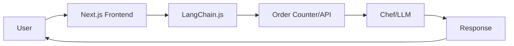
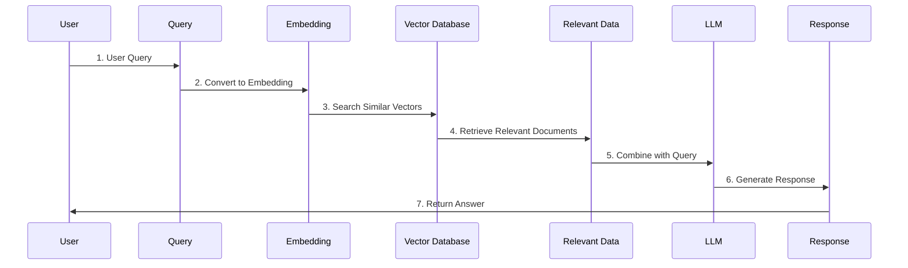
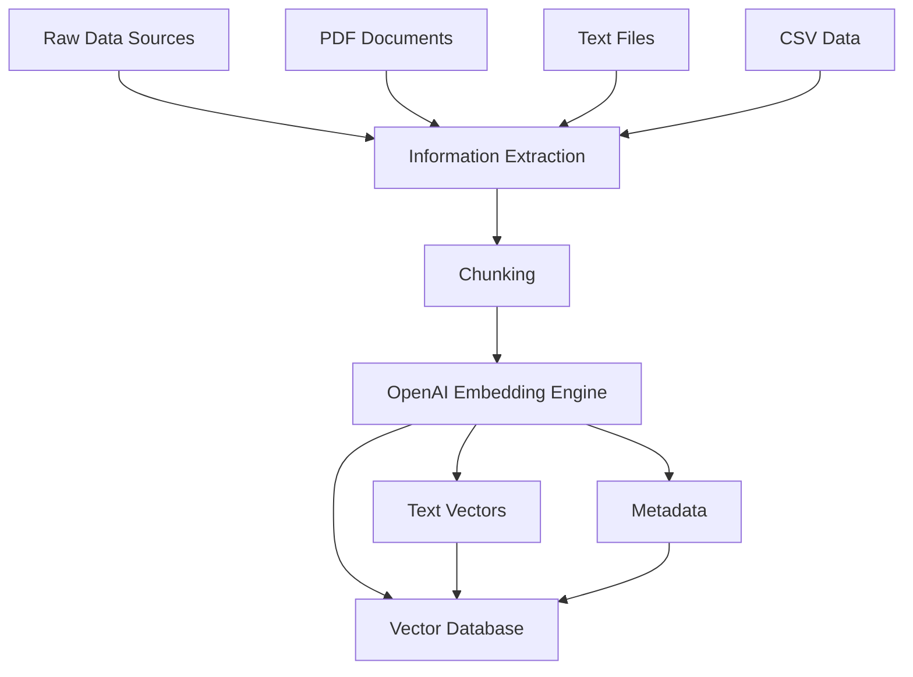

# 🎯 Skin Vision AI - Presentation Script

## 📊 Architecture Overview

สวัสดีครับ วันนี้ผมจะมานำเสนอโปรเจค **Skin Vision AI** ซึ่งเป็น AI Chatbot สำหรับการวิเคราะห์และให้คำแนะนำเกี่ยวกับปัญหาสิว โดยใช้เทคโนโลยี LangChain และ RAG (Retrieval Augmented Generation)

---

## 🏗️ ส่วนที่ 1: LangChain Architecture

### การทำงานของระบบโดยรวม

**อธิบาย:**
- **User**: ผู้ใช้งานที่ส่งคำถามหรืออัปโหลดรูปภาพ
- **Next.js Frontend**: หน้าเว็บไซต์ที่ผู้ใช้โต้ตอบ
- **LangChain.js**: Framework ที่จัดการการสื่อสารระหว่าง Frontend และ Backend
- **Order Counter/API**: ระบบจัดการคำขอและประมวลผล
- **Chef/LLM**: โมเดล AI (GPT, Gemini) ที่ทำการวิเคราะห์และตอบคำถาม

### จุดเด่นของ LangChain:
1. **Integration ที่ง่าย**: เชื่อมต่อกับ LLM หลายตัวได้
2. **Chain Operations**: สามารถทำงานแบบขั้นตอนได้
3. **Memory Management**: จัดเก็บประวัติการสนทนา
4. **Tool Integration**: รองรับ Function Calling และ RAG

---

## 🔍 ส่วนที่ 2: RAG (Retrieval Augmented Generation) Process

### ขั้นตอนการทำงานของ RAG

**รายละเอียดแต่ละขั้นตอน:**

### 1. Query Processing
- ผู้ใช้ส่งคำถามเกี่ยวกับสิว
- ระบบแปลงคำถามเป็น embedding vector

### 2. Vector Search
- ค้นหาเอกสารที่เกี่ยวข้องใน Vector Database
- ใช้ cosine similarity เพื่อหาความคล้ายคลึง

### 3. Context Retrieval
- ดึงเอกสารที่เกี่ยวข้องมากที่สุด 3-5 เอกสาร
- รวบรวมข้อมูลเป็น context

### 4. LLM Generation
- ส่ง context + คำถาม ไปยัง LLM
- LLM สร้างคำตอบที่อ้างอิงจากข้อมูลที่ถูกต้อง

### ประโยชน์ของ RAG:
- **ความแม่นยำสูง**: ตอบจากข้อมูลจริง
- **Up-to-date**: สามารถอัปเดตข้อมูลได้
- **Traceable**: สามารถตรวจสอบแหล่งที่มาได้

---

## 🧠 ส่วนที่ 3: Embedding Process

### การแปลงเอกสารเป็น Vector Embeddings

**Data Preparation Pipeline:**

### A. Raw Data Sources
ในโปรเจคมีข้อมูลหลัก 3 ประเภท:
- **PDF Files**: เอกสารทางการแพทย์เกี่ยวกับสิว
  - Acne-Department of Medical Sciences.pdf
  - Acne-Faculty of Medicine Siriraj Hospital.pdf
  - Guidelines for acne medication.pdf
- **Text Files**: ข้อมูลเพิ่มเติม (information.txt)
- **CSV Files**: ข้อมูลผลิตภัณฑ์ (product.csv)

### B. Information Extraction
- **OCR**: แปลง PDF เป็นข้อความ
- **Text Processing**: ทำความสะอาดข้อมูล
- **Structure Parsing**: แยกหัวข้อและเนื้อหา

### C. Chunking
- แบ่งเอกสารเป็นส่วนเล็กๆ (chunks)
- ขนาดประมาณ 500-1000 tokens ต่อ chunk
- รักษา context ระหว่าง chunks

### D. OpenAI Embedding Engine
- ใช้โมเดล `text-embedding-3-small`
- แปลงข้อความเป็น vector 1536 มิติ
- สร้าง semantic representation

### E. Vector Database Storage
- เก็บ vectors ใน PostgreSQL + pgvector
- รวมทั้ง metadata และ text ต้นฉบับ
- รองรับ similarity search

---

## 🗄️ ส่วนที่ 4: Database Schema

### มีทั้งหมด 5 ตาราง โดยตาราง:
- ตาราง **chat_sessions** และ **chat_messages** เกี่ยวกับแชทบอท  
- ตาราง **products** และ **sales** เกี่ยวกับข้อมูลสินค้าและกสารขาย โดยเป็นข้อมูล ที่ mock ไว้และไว้พัฒนาต่อในอนาคต
- ตาราง **documents** เป็นตารางที่เก็บข้อมูลเกี่ยวกับเอกสาร โดยเก็บเป็น Vector

### Key Relationships:
- **User Authentication**: เชื่อมกับ Supabase Auth
- **Chat History**: เก็บประวัติการสนทนาแต่ละ session
- **Vector Search**: ใช้ pgvector สำหรับ similarity search
- **Product Integration**: เชื่อมข้อมูลผลิตภัณฑ์กับคำแนะนำ

---

## 📈 ส่วนที่ 5: Performance & Scalability

### Current Performance
- **Response Time**: < 2 วินาที สำหรับ text queries
- **Image Analysis**: < 5 วินาที สำหรับ image processing
